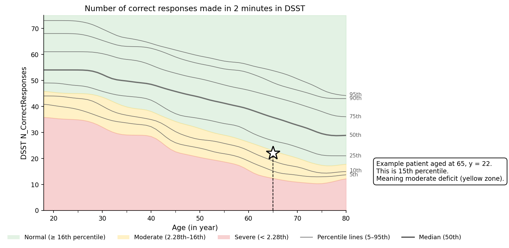

# Octal age-stratified normative data

Written by Sijia Zhao (sijia.zhao@psy.ox.ac.uk) on 12 May 2026, polished and audited by Claude Opus 4.7.

**Generated**: 2026-05-12 from a pooled healthy-control sample (N = 2,300, age 18-80).

## How to use

Two scenarios, two answers:

### 1. You want to adjust for age (group comparisons, regression covariates, centring scores)

**Z-score against the age-matched mean and SD is fine.**

```python
z = (patient_value - age_mean) / age_sd        # higher-is-better metrics
z = -(patient_value - age_mean) / age_sd       # lower-is-better metrics (RT, errors)
```

This works for any metric. You're using the norm purely to remove the age effect so that participants of different ages are on a comparable scale. The shape of the underlying distribution doesn't bias the centring — the mean is still a valid central tendency, regardless of skew.

### 2. You want to classify individual patients as impaired (moderate / severe)

**Use percentile rank, not z-thresholds.**

```python
from apply_norm import age_percentile
pct = age_percentile("DSST_RT", value=4.2, age=65)   # → ~20th percentile (slower than 80% of age-matched HC)
```

The reason: most OCTAL metrics are skewed in their raw form. Accuracy metrics ceiling out in healthy controls (heavy left-skew) and RTs have a long right tail (right-skew). On these distributions, the standard clinical z cut-offs (z < −1 = moderate, z < −2 = severe) **do not correspond to the percentile bands they're supposed to represent.**

Specifically, on the OCTAL data:

- At the **z = −1 threshold** (Gaussian-implied 16th percentile = moderate impairment), the actual proportion of healthy controls below the cut-off is usually **half of that or less** (often 6-12% rather than 16%). So *z* < −1 **misses roughly half of moderately impaired patients** — it underestimates impairment.
- At the **z = −2 threshold** (Gaussian-implied 2.3rd percentile = severe), the heavy tail of the distribution catches up: 3-6% of HC sit below the cut-off, so this threshold somewhat *over*-flags severe impairment.

The clean fix is to read the clinical bands off the empirical percentiles instead: **<16th percentile = moderate, <2.28th = severe** (the Gaussian-equivalent of z = −1 and z = −2, applied directly on the empirical distribution). This is distribution-free, the labels match reality at every threshold, and the same code works for every metric. The helper `apply_norm.py` sign-flips automatically, so a low percentile always means impaired regardless of the metric's direction.

### Worked example

The figure below shows the clinical impairment bands across age for one example metric: **DSST n correct responses**. The colour scheme follows the clinical convention used in our group:

- **Green** — at or above the 16th percentile — normal
- **Yellow** — between the 2.28th and 16th percentile — moderate
- **Red** — below the 2.28th percentile — severe

These percentile boundaries match the Gaussian-equivalent z = −1 (16th) and z = −2 (2.28th) — the standard clinical convention — but they're applied directly on the empirical distribution so the band always means what the label says, regardless of whether the metric is skewed.

The thin grey lines are the 5th, 10th, 25th, 75th, 90th and 95th percentile curves across age; the thicker grey line is the median (50th).



A patient's score is placed on the y-axis at their age (x-axis); the colour underneath tells you the impairment band. In the figure, an age-65 patient with DSST n correct = 22 sits at the 15th percentile — just inside the moderate (yellow) zone.

To re-derive a figure like this from your own patient cohort: filter the norm file to the age year you want, look up the `<metric>_p5` … `<metric>_p95` columns, and plot or interpolate to place each patient on the percentile axis. The helper `apply_norm.py` does the interpolation for you.

The `Octal_Normality_Summary.csv` lists which metrics are approximately normal and which are skewed — useful background, but **you don't need to consult it to use the norms**. Use z-scores when you're centring for analysis, use percentiles when you're flagging impairment.

### Can I just convert a z-score into a percentile via the normal CDF?

Short answer: **only for a few metrics.** This is a common assumption (e.g. `z = −1` → 16th percentile, `z = −2` → 2.3rd percentile) and it relies on the within-age distribution being approximately Gaussian. For OCTAL, that holds for a minority of metrics.

Of 24 metrics, the ones where the Gaussian z→percentile mapping is approximately safe (|skew| < 0.5 of the age-detrended residuals) are: `DSST_nCorrectResponse`, `OIS_LTM_Acc`, `OIS_STM_LocErr`, `OIS_LTM_LocErr`, `OMT_Misbinding` on the raw scale, plus `OMT_LocErr`, `OMT_Imprecision`, `TMT_BdA` on the **log** scale.

For the remaining 16 metrics — including all accuracy metrics that ceiling out (`DSST_pHit`, `ROCF_*`, `OIS_STM_Acc`, `OMT_Acc`) and all RTs (`DSST_RT`, `OMT_IdeRT`, `OMT_LocRT`, `TMT_A`, `TMT_B`) — the residuals are skewed enough that the Gaussian mapping is unreliable. Concretely, the proportion of HC below `z = −1` on these metrics is typically 6–12%, not the Gaussian-implied 16%; below `z = −2` it is 3–6%, not 2.28%. So z-thresholds **under-flag moderate impairment** and slightly **over-flag severe impairment** relative to what the labels suggest.

The robust route in both cases is to read the percentile rank directly off the per-age percentile columns (`<metric>_p5` … `<metric>_p95`) and interpolate. `apply_norm.py` does this in one call. The output has the same clinical meaning across every metric — there's no exception list to remember.

## Files in this folder

| File | Contents |
|---|---|
| `Octal_MetricsByAge_Raw.csv` | **The norms.** Wide format, one row per age year (18-80). Columns: `age`, `n_total` (HC with any OCTAL data in the ±5 y window), and for each of the 24 metrics: `<metric>_n`, `<metric>_mean`, `<metric>_sd`, percentiles `<metric>_p5 / p10 / p25 / p50 / p75 / p90 / p95`, plus `<metric>_log_mean` and `<metric>_log_sd` for RT / error metrics. |
| `Octal_Normality_Summary.csv` | **Background.** One row per (metric, scale). Skewness, excess kurtosis, and Shapiro-Wilk p of the age-detrended residuals. Tells you which metrics are approximately Gaussian (so z ↔ percentile via the normal CDF is safe) and which are not. |
| `apply_norm.py` | Optional Python helper. Takes a value + age + metric and returns the percentile rank (sign-flipped automatically so a low percentile always means impaired). Also exposes `age_z_score()` for the centred-for-analysis case. |
| `additional/fig_example_clinical_bands.png` | Example figure (see *Worked example* above). |

## How the norms are computed

For each age year `a ∈ {18, …, 80}` and each metric:

1. **Window**: HC participants with age in `(a − 5, a + 5)`.
2. **Outlier removal**: drop values with `|z| > 2` within the window.
3. **Gaussian kernel weighting** (σ = 2.5) → weighted mean.
4. **Unbiased weighted SD**: correction = Σw / (Σw² − Σw · w²).
5. **Percentiles** (`p5 / p10 / p25 / p50 / p75 / p90 / p95`): unweighted, after outlier removal.
6. **Log mean / SD**: same as 3–4 but on `log(value)`, computed for RT and error metrics where the log scale is closer to normal.

For the normality summary (`Octal_Normality_Summary.csv`):

7. Compute each participant's **residual** (raw value − the kernel-weighted mean at their nearest age year) to remove age structure. Then report **skewness**, **excess kurtosis**, and **Shapiro-Wilk p** of those residuals. With N ≈ 2,000, Shapiro p is dominated by sample size — skewness is the more interpretable single number (|skew| < 0.5 ≈ normal, 0.5–1 = moderate, > 1 = strong).

## Sample size by age

Window N at age 49 (middle of range): ~370-400 for most metrics, ~90-200 for the OMT spatial-error metrics (which use a restricted source set; see below). Drops to ~60 at the age extremes (18 and 80). Per-metric N is in the `<metric>_n` column of the wide file.

## Direction convention

Higher-is-better metrics (accuracy / scores): a *low* percentile rank indicates impairment. The helper `apply_norm.py` returns the percentile directly.

Lower-is-better metrics (RT and error metrics — `DSST_RT`, `OMT_IdeRT`, `OMT_LocRT`, `TMT_A`, `TMT_B`, `TMT_average`, `TMT_BdA`, `OIS_*LocErr`, `OMT_LocErr`, `OMT_Imprecision`, `OMT_Misbinding`, `OMT_Guessing`): a *high* raw value indicates impairment. The helper sign-flips the percentile so a *low* percentile rank always means impaired — same interpretation for every metric.

If you're not using the helper, the lookup is: find the percentile column whose threshold your patient's score falls below (for higher-is-better) or above (for lower-is-better); linearly interpolate between adjacent percentiles for finer resolution.

## Scale restriction for spatial-error metrics

Four metrics — `OMT_LocErr`, `OMT_Imprecision`, `OIS_STM_LocErr`, `OIS_LTM_LocErr` — are reported in different unit conventions across data sources (pixel coordinates vs normalised proportion-of-screen-radius). The norms here are computed only from sources that store these on the **normalised proportion-of-screen-radius scale**.

**Use these norms only if your test data are on the same normalised scale.** Typical HC medians: `OMT_LocErr` ≈ 0.12, `OIS_LTM_LocErr` ≈ 0.20. If your data are in pixels, normalise to proportion-of-screen-radius (divide each pixel error by the screen radius from the participant's OCTAL session) before comparing.

## Column naming

The file uses **npj-Digital-Medicine-compatible column names** (`OIS_STM_Acc` for immediate-recall object accuracy, `OIS_LTM_Acc` for delayed-recall, etc.) for backward compatibility. Mapping:

| Norm file column | Synonym (Immediate-Delayed naming) |
|---|---|
| `DSST_RT` | `DSST_rt` |
| `DSST_pHit` | `DSST_pHit` (0–1 proportion) |
| `DSST_nCorrectResponse` | `DSST_nCorrectResponse` |
| `ROCF_CopyScore`, `ROCF_RecallScore` | `ROCF_copy_score`, `ROCF_recall_score` |
| `ROCF_Remember` | computed: `recall_score / copy_score × 100` |
| `OIS_STM_Acc`, `OIS_LTM_Acc` | `OIS_ImmediateObjectAccuracy`, `OIS_DelayedObjectAccuracy` |
| `OIS_STM_SemanticAcc`, `OIS_LTM_SemanticAcc` | `OIS_*SemanticAccuracy` |
| `OIS_STM_LocErr`, `OIS_LTM_LocErr` | `OIS_*LocationError` (normalised scale only) |
| `OMT_Acc` | `OMT_ProportionCorrect` (0–1 proportion) |
| `OMT_TargetDetection`, `OMT_Misbinding`, `OMT_Guessing` | same |
| `OMT_IdeRT`, `OMT_LocRT` | `OMT_IdentificationTime`, `OMT_LocalisationTime` |
| `OMT_LocErr`, `OMT_Imprecision` | `OMT_AbsoluteError`, `OMT_Imprecision` (normalised scale only) |
| `TMT_A`, `TMT_B`, `TMT_BdA`, `TMT_average` | same |

